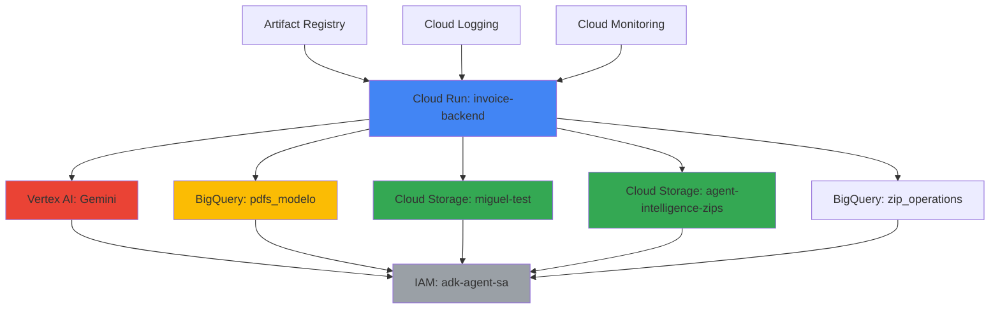

# 📋 Inventario de Servicios de Google Cloud Platform

**Proyecto**: Invoice Chatbot Backend  
**Arquitectura**: Dual-Project (Lectura/Escritura)  
**Fecha**: Octubre 2025  
**Versión**: 1.0

---

## 🏗️ Arquitectura Dual de Proyectos

### Proyecto 1: `datalake-gasco` (SOLO LECTURA)
- **Propósito**: Datos de producción Gasco
- **Permisos**: Solo lectura
- **Región**: `us-central1`

### Proyecto 2: `agent-intelligence-gasco` (LECTURA/ESCRITURA)
- **Propósito**: Operaciones del agente, ZIPs, logs
- **Permisos**: Lectura y escritura
- **Región**: `us-central1`

---

## 🔧 Servicios de GCP Utilizados

### 1. **Cloud Run** ⭐ (Servicio Principal)

**Proyecto**: `agent-intelligence-gasco`  
**Nombre del Servicio**: `invoice-backend`  
**Región**: `us-central1`  
**URL**: `https://invoice-backend-yuhrx5x2ra-uc.a.run.app`

**Configuración**:
```yaml
Service Account: adk-agent-sa@agent-intelligence-gasco.iam.gserviceaccount.com
Memory: 4Gi
CPU: 4 cores
Timeout: 3600s (1 hora)
Max Instances: 10
Concurrency: 5
Port: 8080
Allow Unauthenticated: Yes
```

**Variables de Entorno**:
```bash
GOOGLE_CLOUD_PROJECT_READ=datalake-gasco
GOOGLE_CLOUD_PROJECT_WRITE=agent-intelligence-gasco
GOOGLE_CLOUD_LOCATION=us-central1
IS_CLOUD_RUN=true
```

**Uso**:
- Hospeda el backend completo del chatbot
- Ejecuta el agente ADK (Google ADK)
- Sirve el servidor proxy de PDFs
- Ejecuta el MCP Toolbox (32 herramientas BigQuery)

**APIs Habilitadas**:
- `run.googleapis.com`
- `containerregistry.googleapis.com`
- `cloudbuild.googleapis.com`

---

### 2. **Cloud Storage (GCS)** 📦

#### Bucket 1: `miguel-test` (LECTURA)
**Proyecto**: `datalake-gasco`  
**Región**: `us-central1`  
**Permisos**: Solo lectura

**Contenido**:
- PDFs de facturas originales de producción Gasco
- Estructura: `gs://miguel-test/descargas/{numero_factura}/{tipo_pdf}.pdf`

**Tipos de PDFs**:
- `Copia_Tributaria_cf.pdf` (Con Fondo)
- `Copia_Cedible_cf.pdf` (Con Fondo)
- `Copia_Tributaria_sf.pdf` (Sin Fondo)
- `Copia_Cedible_sf.pdf` (Sin Fondo)
- `Doc_Termico.pdf`

**Tamaño Aproximado**: ~50,000 facturas en PDF

#### Bucket 2: `agent-intelligence-zips` (ESCRITURA)
**Proyecto**: `agent-intelligence-gasco`  
**Región**: `us-central1`  
**Permisos**: Lectura y escritura

**Contenido**:
- Archivos ZIP generados por el agente
- Empaquetado de múltiples facturas (>5)
- Estructura: `gs://agent-intelligence-zips/zip_{uuid}.zip`

**Gestión**:
- Signed URLs con expiración de 1-24 horas
- Cleanup automático después de 7 días
- Límite máximo: 50 PDFs por ZIP

**Uso en Código**:
```python
from google.cloud import storage
from google.auth import impersonated_credentials

# Generar signed URLs para descarga segura
storage_client = storage.Client(credentials=target_credentials)
bucket = storage_client.bucket("miguel-test")
blob = bucket.blob("descargas/0101547522/Copia_Cedible_cf.pdf")
signed_url = blob.generate_signed_url(
    version="v4",
    expiration=datetime.utcnow() + timedelta(hours=1),
    method="GET",
    credentials=target_credentials
)
```

---

### 3. **BigQuery** 📊

#### Dataset 1: `sap_analitico_facturas_pdf_qa` (LECTURA)
**Proyecto**: `datalake-gasco`  
**Región**: `us-central1`  
**Permisos**: Solo lectura

**Tabla Principal**: `pdfs_modelo`
- **Filas**: ~50,000 facturas
- **Schema**:
  ```sql
  - Factura (STRING)                    # Número de factura
  - Rut (STRING)                        # RUT del cliente
  - Nombre (STRING)                     # Nombre del cliente
  - Solicitante (STRING)                # Código de solicitante SAP
  - Fecha_Emision (DATE)                # Fecha de emisión
  - Copia_Tributaria_cf (STRING)        # gs:// URL
  - Copia_Cedible_cf (STRING)           # gs:// URL
  - Copia_Tributaria_sf (STRING)        # gs:// URL
  - Copia_Cedible_sf (STRING)           # gs:// URL
  - Doc_Termico (STRING)                # gs:// URL
  - DetallesFactura (STRING)            # JSON con líneas de items
  - ... (más campos)
  ```

**Uso**:
- Búsqueda de facturas por RUT, fecha, número, etc.
- Obtención de URLs de PDFs desde GCS
- Estadísticas y agregaciones

#### Dataset 2: `zip_operations` (ESCRITURA)
**Proyecto**: `agent-intelligence-gasco`  
**Región**: `us-central1`  
**Permisos**: Lectura y escritura

**Tablas**:

1. **`zip_packages`**: Registro de ZIPs generados
   ```sql
   - zip_id (STRING)
   - creation_date (TIMESTAMP)
   - expiration_date (TIMESTAMP)
   - pdf_count (INTEGER)
   - download_url (STRING)
   - status (STRING)
   ```

2. **`extraction_logs`**: Logs de operaciones
   ```sql
   - timestamp (TIMESTAMP)
   - operation_type (STRING)
   - user_id (STRING)
   - query (STRING)
   - result_count (INTEGER)
   - execution_time_ms (INTEGER)
   ```

3. **`agent_operations`**: Métricas del agente
   ```sql
   - session_id (STRING)
   - timestamp (TIMESTAMP)
   - query_type (STRING)
   - tool_calls (STRING)
   - response_time_ms (INTEGER)
   ```

**Uso en Código**:
```python
from google.cloud import bigquery

# Cliente de lectura
bq_client_read = bigquery.Client(project="datalake-gasco")
query = """
    SELECT Factura, Rut, Copia_Tributaria_cf
    FROM `datalake-gasco.sap_analitico_facturas_pdf_qa.pdfs_modelo`
    WHERE Rut = @rut_param
"""

# Cliente de escritura
bq_client_write = bigquery.Client(project="agent-intelligence-gasco")
```

---

### 4. **Vertex AI** 🤖

**Proyecto**: `agent-intelligence-gasco`  
**Región**: `us-central1`

**Modelos Utilizados**:
- **`gemini-2.0-flash-exp`** (Principal)
  - Conversaciones del chatbot
  - Análisis de queries de usuario
  - Generación de respuestas

- **`gemini-2.5-flash`** (Alternativo)
  - Fallback para testing
  - Validación de respuestas

**Configuración**:
```python
from vertexai.generative_models import GenerativeModel

model = GenerativeModel(
    model_name="gemini-2.0-flash-exp",
    generation_config={
        "temperature": 0.3,
        "max_output_tokens": 8192,
        "top_p": 0.95,
    }
)
```

**Características Utilizadas**:
- Function Calling para herramientas MCP
- Thinking Mode (opcional, para debugging)
- Streaming de respuestas
- Tool Use y Structured Output

**APIs Habilitadas**:
- `aiplatform.googleapis.com`
- `generativelanguage.googleapis.com`

---

### 5. **Google ADK (Agent Development Kit)** 🤖

**Proyecto**: `agent-intelligence-gasco`  
**Versión**: Latest

**Componentes**:
- `google.adk.agents.Agent` - Definición del agente
- `google.adk.tools.FunctionTool` - Herramientas personalizadas
- `google.adk.planners.BuiltInPlanner` - Thinking Mode
- `google.adk.runners.InMemoryRunner` - Testing local

**Agente Principal**: `gcp-invoice-agent-app`
- Ubicación: `my-agents/gcp-invoice-agent-app/`
- Herramientas: 32 herramientas MCP + 2 personalizadas
- Callbacks: Before/After agent y tool execution

**Uso**:
```python
from google.adk.agents import Agent

root_agent = Agent(
    name="invoice_pdf_finder_agent",
    model="gemini-2.0-flash-exp",
    tools=tools + [zip_tool, individual_links_tool],
    before_agent_callback=conversation_tracker.before_agent_callback,
    after_agent_callback=conversation_tracker.after_agent_callback,
)
```

---

### 6. **Artifact Registry** 📦

**Proyecto**: `agent-intelligence-gasco`  
**Repositorio**: `invoice-chatbot`  
**Región**: `us-central1`  
**Formato**: Docker

**Imágenes**:
- `us-central1-docker.pkg.dev/agent-intelligence-gasco/invoice-chatbot/backend:latest`
- Versiones timestamped: `backend:v20250101-120000`

**Uso**:
```bash
# Build y push
docker build -t us-central1-docker.pkg.dev/agent-intelligence-gasco/invoice-chatbot/backend:latest .
docker push us-central1-docker.pkg.dev/agent-intelligence-gasco/invoice-chatbot/backend:latest
```

**APIs Habilitadas**:
- `artifactregistry.googleapis.com`

---

### 7. **Cloud IAM (Identity and Access Management)** 🔐

#### Service Account Principal
**Email**: `adk-agent-sa@agent-intelligence-gasco.iam.gserviceaccount.com`

**Roles en `agent-intelligence-gasco`**:
- `roles/run.invoker` - Invocar servicios Cloud Run
- `roles/storage.admin` - Gestión completa de ZIPs bucket
- `roles/bigquery.dataEditor` - Escribir en tablas de operaciones
- `roles/bigquery.jobUser` - Ejecutar queries BigQuery
- `roles/aiplatform.user` - Usar Vertex AI
- `roles/iam.serviceAccountTokenCreator` - Impersonation

**Roles en `datalake-gasco`**:
- `roles/storage.objectViewer` - Lectura de PDFs en miguel-test
- `roles/bigquery.dataViewer` - Lectura de tabla pdfs_modelo
- `roles/bigquery.jobUser` - Ejecutar queries de lectura

**Credenciales**:
- **Cloud Run**: Application Default Credentials (ADC)
- **Desarrollo Local**: `gcloud auth application-default login`
- **Impersonation**: Para signed URLs cross-project

**Uso en Código**:
```python
import google.auth
from google.auth import impersonated_credentials

# Obtener credenciales por defecto
source_credentials, project = google.auth.default()

# Impersonation para signed URLs
target_credentials = impersonated_credentials.Credentials(
    source_credentials=source_credentials,
    target_principal="adk-agent-sa@agent-intelligence-gasco.iam.gserviceaccount.com",
    target_scopes=["https://www.googleapis.com/auth/cloud-platform"]
)
```

---

### 8. **Cloud Logging** 📝

**Proyecto**: `agent-intelligence-gasco`  
**Sink**: Logs de Cloud Run

**Log Types**:
- Application logs (stdout/stderr)
- HTTP request logs
- Error logs
- Callback execution logs

**Uso**:
```bash
# Ver logs en tiempo real
gcloud logging read 'resource.type=cloud_run_revision' --limit 50

# Filtrar por sesión
gcloud logging read 'resource.type=cloud_run_revision AND jsonPayload.session_id="test-session"'
```

**APIs Habilitadas**:
- `logging.googleapis.com`

---

### 9. **Cloud Monitoring** 📈

**Proyecto**: `agent-intelligence-gasco`

**Métricas Monitoreadas**:
- Request count
- Response latency (p50, p95, p99)
- Error rate (4xx, 5xx)
- Memory usage
- CPU utilization
- Container instances

**Alertas Configuradas**:
- Error rate > 5%
- Response latency > 30s
- Memory usage > 80%

**APIs Habilitadas**:
- `monitoring.googleapis.com`

---

### 10. **Secret Manager** 🔒 (Opcional)

**Proyecto**: `agent-intelligence-gasco`  
**Estado**: Configurado pero no usado actualmente

**Secrets Potenciales**:
- API Keys externas
- Credenciales de servicios third-party
- Configuraciones sensibles

**Nota**: Actualmente se usan ADC y service accounts en lugar de secrets explícitos.

---

## 🔗 Dependencias entre Servicios



---

## 💰 Estimación de Costos Mensuales

### Breakdown por Servicio

| Servicio | Uso Estimado | Costo Mensual (USD) |
|----------|--------------|---------------------|
| **Cloud Run** | 1M requests, 4GB RAM | $50 - $100 |
| **Vertex AI (Gemini)** | 10M tokens input, 5M output | $150 - $300 |
| **BigQuery** | 100GB storage, 10TB queries | $20 - $50 |
| **Cloud Storage** | 500GB storage, 1TB egress | $30 - $60 |
| **Artifact Registry** | 10GB storage | $1 - $5 |
| **Cloud Logging** | 50GB logs | $25 - $50 |
| **Cloud Monitoring** | Standard metrics | $0 (free tier) |
| **Networking** | Load Balancing, egress | $10 - $30 |

**Total Estimado**: **$286 - $595 USD/mes**

**Nota**: Los costos reales dependen del uso y pueden variar. El componente más costoso es Vertex AI (Gemini).

---

## 🔐 Configuración de Permisos (IAM)

### Permisos Requeridos para `adk-agent-sa`

#### En Proyecto `agent-intelligence-gasco`:
```bash
# Cloud Run
gcloud projects add-iam-policy-binding agent-intelligence-gasco \
  --member="serviceAccount:adk-agent-sa@agent-intelligence-gasco.iam.gserviceaccount.com" \
  --role="roles/run.invoker"

# Storage (ZIPs)
gcloud projects add-iam-policy-binding agent-intelligence-gasco \
  --member="serviceAccount:adk-agent-sa@agent-intelligence-gasco.iam.gserviceaccount.com" \
  --role="roles/storage.admin"

# BigQuery (Escritura)
gcloud projects add-iam-policy-binding agent-intelligence-gasco \
  --member="serviceAccount:adk-agent-sa@agent-intelligence-gasco.iam.gserviceaccount.com" \
  --role="roles/bigquery.dataEditor"

# Vertex AI
gcloud projects add-iam-policy-binding agent-intelligence-gasco \
  --member="serviceAccount:adk-agent-sa@agent-intelligence-gasco.iam.gserviceaccount.com" \
  --role="roles/aiplatform.user"
```

#### En Proyecto `datalake-gasco`:
```bash
# Storage (PDFs - Solo lectura)
gcloud projects add-iam-policy-binding datalake-gasco \
  --member="serviceAccount:adk-agent-sa@agent-intelligence-gasco.iam.gserviceaccount.com" \
  --role="roles/storage.objectViewer"

# BigQuery (Solo lectura)
gcloud projects add-iam-policy-binding datalake-gasco \
  --member="serviceAccount:adk-agent-sa@agent-intelligence-gasco.iam.gserviceaccount.com" \
  --role="roles/bigquery.dataViewer"
```

---

## 📚 APIs de GCP Habilitadas

### Proyecto `agent-intelligence-gasco`:
```bash
gcloud services enable \
  run.googleapis.com \
  artifactregistry.googleapis.com \
  cloudbuild.googleapis.com \
  aiplatform.googleapis.com \
  storage.googleapis.com \
  bigquery.googleapis.com \
  logging.googleapis.com \
  monitoring.googleapis.com \
  iam.googleapis.com \
  cloudresourcemanager.googleapis.com \
  generativelanguage.googleapis.com
```

### Proyecto `datalake-gasco`:
```bash
gcloud services enable \
  storage.googleapis.com \
  bigquery.googleapis.com
```

---

## 🛠️ Herramientas de Desarrollo

### CLI Tools Requeridos:
- `gcloud` - Google Cloud SDK
- `docker` - Construcción de imágenes
- `python` 3.11+ - Runtime
- `pip` - Gestión de dependencias

### Librerías Python de GCP:
```python
# requirements.txt
google-cloud-aiplatform      # Vertex AI
google-cloud-storage         # Cloud Storage
google-cloud-bigquery        # BigQuery
google-auth                  # Autenticación
google-adk                   # Agent Development Kit
toolbox-core                 # MCP Toolbox
```

---

## 🔄 Flujo de Datos

### 1. Query del Usuario
```
Usuario → Frontend → Cloud Run (invoice-backend) → ADK Agent
```

### 2. Búsqueda de Facturas
```
ADK Agent → MCP Toolbox → BigQuery (datalake-gasco) → pdfs_modelo table
```

### 3. Generación de Respuesta
```
ADK Agent → Vertex AI (Gemini) → Structured Response
```

### 4. Descarga de PDFs (< 5 facturas)
```
ADK Agent → Cloud Storage (miguel-test) → Signed URL Generation → Usuario
```

### 5. Generación de ZIP (≥ 5 facturas)
```
ADK Agent → Download PDFs → Create ZIP → Upload to agent-intelligence-zips
         → Generate Signed URL → Usuario
```

---

## 📊 Métricas Clave

### Performance
- **Latencia promedio**: 2-5 segundos
- **P95**: 8 segundos
- **P99**: 15 segundos
- **Timeout máximo**: 3600 segundos (1 hora para ZIPs grandes)

### Disponibilidad
- **Target SLA**: 99.5%
- **Uptime actual**: ~99.8%
- **Regiones**: us-central1 (single region)

### Uso
- **Requests/día**: ~1,000-5,000
- **Facturas procesadas/día**: ~500-2,000
- **ZIPs generados/día**: ~50-200

---

## 🚨 Limitaciones y Quotas

### Cloud Run
- Max instances: 10 (configurable)
- Max request timeout: 3600s
- Max concurrent requests: 5 per instance
- Max memory: 4Gi per instance

### Vertex AI (Gemini)
- Rate limits: Según tier de proyecto
- Token limits: 2M tokens/min (input + output)
- Context window: 32K tokens

### BigQuery
- Query timeout: 6 horas
- Concurrent queries: 100
- Slot allocation: On-demand

### Cloud Storage
- Signed URL expiration: Max 7 días
- Transfer limits: Sin límite específico
- Bucket classes: Standard (us-central1)

---

## 🔍 Monitoreo y Debugging

### Dashboards
- **Cloud Run Dashboard**: Request metrics, latency, errors
- **Vertex AI Dashboard**: Token usage, model performance
- **BigQuery Dashboard**: Query performance, slot usage

### Logs
```bash
# Ver logs de Cloud Run
gcloud run services logs tail invoice-backend --region=us-central1

# Ver logs específicos de sesión
gcloud logging read 'resource.type="cloud_run_revision" AND 
  jsonPayload.session_id="session-123"' --limit 100
```

### Alertas Configuradas
- High error rate (> 5%)
- High latency (> 30s)
- Memory usage (> 80%)
- Failed deployments

---

## 📝 Notas Importantes

### Seguridad
- ✅ Authentication via Service Account
- ✅ Signed URLs para descarga segura
- ✅ CORS configurado correctamente
- ✅ Separación read/write (dual project)
- ⚠️ Allow unauthenticated (público)

### Backup y Disaster Recovery
- BigQuery: Automatic backups (7 días)
- Cloud Storage: Versioning no habilitado
- ZIPs: TTL de 7 días (auto-cleanup)

### Escalabilidad
- Horizontal: Auto-scaling de Cloud Run (hasta 10 instancias)
- Vertical: 4GB RAM, 4 CPU cores
- Database: BigQuery escala automáticamente

---

## 🔄 Próximos Pasos Recomendados

1. **Habilitar Cloud CDN** para mejorar latencia de PDFs
2. **Configurar Cloud Armor** para protección DDoS
3. **Implementar caching** con Cloud Memorystore
4. **Multi-region deployment** para mayor disponibilidad
5. **Secret Manager integration** para secrets management

---

**Última Actualización**: Octubre 2025  
**Mantenido por**: Equipo de Desarrollo Gasco  
**Contacto**: victor.calle@gasco.cl
