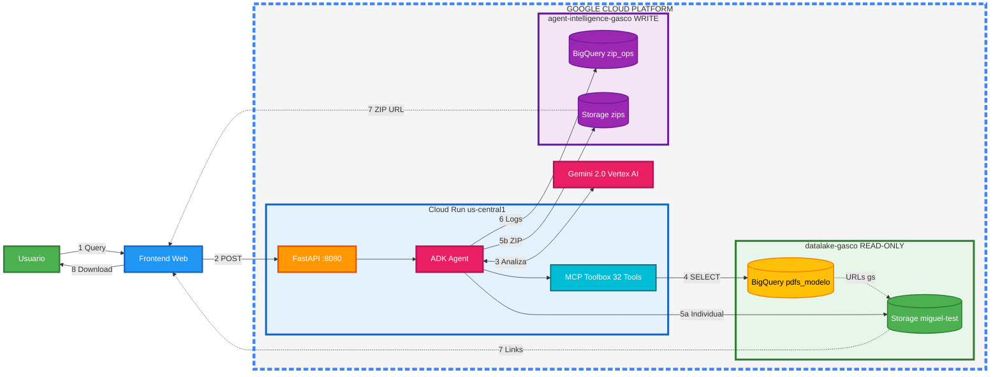

# Arquitectura del Sistema: Invoice Chatbot Backend

**Proyecto**: Invoice Chatbot - Arquitectura Dual-Project GCP  
**Fecha**: Octubre 2025  
**Versión**: 1.1 (Corregida)

---

## Vista General de la Arquitectura

---

## Explicación del Flujo (Paso a Paso)

### Flujo Principal

#### **Paso 1: Query (Consulta del Usuario)**
- El usuario escribe una consulta en lenguaje natural
- Ejemplo: _"Dame las facturas del RUT 12345678-9"_
- El frontend captura esta consulta

#### **Paso 2: POST (Envío de Request)**
- El frontend envía la consulta al backend
- Método: `POST /callback`
- Servidor: FastAPI en Cloud Run puerto 8080

#### **Paso 3: Analiza (Procesamiento con IA)**
- El ADK Agent envía la consulta a **Gemini 2.0** (Vertex AI)
- Gemini **analiza la intención** del usuario
- Decide qué herramientas usar para responder
- Ejemplo: Identifica que necesita buscar facturas por RUT

#### **Paso 4: SELECT (Consulta a Base de Datos)**
- El **MCP Toolbox** ejecuta una consulta SQL en BigQuery
- Base de datos: `pdfs_modelo` en proyecto `datalake-gasco`
- Ejemplo: `SELECT * FROM pdfs_modelo WHERE Rut = '12345678-9'`
- Retorna información de las facturas encontradas (número, fecha, URLs de PDFs)

#### **Paso 5a: Individual (Pocas Facturas)**
- Si se encuentran **menos de 5 facturas**
- El sistema genera **URLs firmadas individuales** para cada PDF
- URLs temporales válidas por **1 hora**
- Acceso directo a PDFs en Cloud Storage `miguel-test`

#### **Paso 5b: ZIP (Muchas Facturas)**
- Si se encuentran **5 o más facturas**
- El sistema **descarga todos los PDFs** y los empaqueta en un archivo ZIP
- Sube el ZIP a Cloud Storage `agent-intelligence-zips`
- Genera URL firmada del ZIP válida por **24 horas**
- Más eficiente para descargas masivas

#### **Paso 6: Logs (Registro de Operaciones)**
- El sistema guarda registro de la operación en BigQuery
- Tablas de log:
  - `zip_operations.zip_packages` - Información de ZIPs generados
  - `zip_operations.extraction_logs` - Historial de consultas
  - `chat_analytics.conversation_logs` - Conversaciones completas
- Sirve para auditoría, análisis y debugging

#### **Paso 7: Links / ZIP URL (Retorno de URLs)**
- El sistema retorna las URLs al frontend
- Caso Individual (5a): Lista de URLs de PDFs individuales
- Caso ZIP (5b): Una URL del archivo ZIP completo
- El frontend muestra botones de descarga al usuario

#### **Paso 8: Download (Descarga del Usuario)**
- El usuario hace clic en el botón de descarga
- Descarga los PDFs directamente o el archivo ZIP
- URLs firmadas garantizan acceso seguro y temporal

---

## Glosario de Componentes

### **Usuario**
Persona que utiliza el chatbot para buscar y descargar facturas.

### **Frontend Web**
Interfaz web donde el usuario interactúa con el chatbot (React, Vue, etc.).

### **Cloud Run us-central1**
Servicio de Google Cloud que hospeda el backend del chatbot.
- **Ubicación**: us-central1 (Iowa, USA)
- **Tipo**: Contenedor Docker serverless
- **Escalamiento**: Automático según demanda

### **FastAPI :8080**
Framework web de Python que recibe las peticiones HTTP.
- **Puerto**: 8080
- **Endpoint principal**: `/callback`
- **Función**: Punto de entrada del backend

### **ADK Agent**
"Agent Development Kit" de Google - El cerebro del chatbot.
- **Función**: Orquesta todas las operaciones
- **Responsabilidad**: Decide qué hacer con cada consulta
- **Integración**: Conecta con Gemini, MCP Tools, y servicios GCP

### **Gemini 2.0 Vertex AI**
Modelo de inteligencia artificial de Google.
- **Función**: Procesa lenguaje natural
- **Capacidades**: Entiende intenciones, genera respuestas naturales
- **Versión**: Gemini 2.0 Flash (rápido y eficiente)

### **MCP Toolbox 32 Tools**
"Model Context Protocol" - Conjunto de 32 herramientas especializadas.
- **Función**: Consultas específicas a BigQuery
- **Ejemplos**:
  - `search_by_rut()` - Buscar por RUT
  - `search_by_date()` - Buscar por fecha
  - `get_pdf_urls()` - Obtener URLs de PDFs
  - ... (29 herramientas más)

### **datalake-gasco READ-ONLY**
Proyecto de Google Cloud con datos de producción (solo lectura).
- **Seguridad**: Permisos de solo lectura
- **Contenido**: Facturas originales de Gasco
- **Acceso**: Cross-project desde agent-intelligence-gasco

### **BigQuery pdfs_modelo**
Tabla de base de datos con información de 50,000 facturas.
- **Datos**: Número de factura, RUT, nombre cliente, fechas, URLs de PDFs
- **Tamaño**: ~50,000 registros
- **Proyecto**: datalake-gasco

### **Storage miguel-test**
Bucket de Cloud Storage con PDFs originales.
- **Contenido**: Archivos PDF de facturas (Copia Tributaria, Copia Cedible, etc.)
- **Acceso**: Solo lectura mediante URLs firmadas
- **Proyecto**: datalake-gasco

### **agent-intelligence-gasco WRITE**
Proyecto de Google Cloud para operaciones del chatbot (lectura y escritura).
- **Función**: Almacena ZIPs, logs, métricas
- **Permisos**: Escritura completa
- **Separación**: Aislado del datalake de producción

### **BigQuery zip_ops**
Base de datos para tracking de operaciones.
- **Tablas**:
  - `zip_packages` - ZIPs generados
  - `zip_files` - Archivos dentro de ZIPs
  - `zip_downloads` - Descargas realizadas
  - `extraction_logs` - Historial de consultas
  - `agent_operations` - Métricas del agente

### **Storage zips**
Bucket para almacenar archivos ZIP temporales.
- **Nombre**: agent-intelligence-zips
- **Contenido**: ZIPs generados cuando hay 5+ facturas
- **TTL**: Los archivos se eliminan después de 7 días
- **Límite**: Máximo 50 PDFs por ZIP

---

## Decisiones Clave del Sistema

### ¿Por qué Individual vs ZIP?

**Individual (< 5 facturas):**
- Descarga inmediata, sin esperar
- No consume espacio en servidor
- URLs válidas 1 hora
- Puede ser tedioso si son varias facturas

**ZIP (≥ 5 facturas):**
- Una sola descarga
- Más organizado para muchas facturas
- URLs válidas 24 horas
- Requiere tiempo de generación (~5-30 seg)

### ¿Por qué dos proyectos GCP?

**Seguridad y Governance:**
- `datalake-gasco`: Datos inmutables de producción (solo lectura)
- `agent-intelligence-gasco`: Operaciones del chatbot (lectura/escritura)
- **Beneficio**: Si el chatbot tiene un bug, NO puede modificar datos de producción

---

## Ejemplo Concreto

**Caso de Uso: "Dame las facturas del RUT 12345678-9 de enero 2025"**

1. **Usuario** escribe en el chat → **Frontend** captura
2. **Frontend** envía POST → **FastAPI** recibe
3. **ADK Agent** consulta → **Gemini** interpreta: "buscar por RUT y fecha"
4. **MCP Tools** ejecuta → **BigQuery**: `SELECT * WHERE Rut='...' AND Fecha='2025-01'`
5. **Resultado**: Se encuentran 8 facturas
6. **Decisión**: 8 > 5 → **Generar ZIP** (ruta 5b)
7. Sistema descarga 8 PDFs → Crea ZIP → Sube a **Storage zips**
8. **Registra** operación en **BigQuery zip_ops**
9. **Retorna** URL del ZIP → **Frontend** muestra botón
10. **Usuario** descarga archivo: `facturas_12345678-9_enero2025.zip`

---

**¿Todo más claro ahora?**