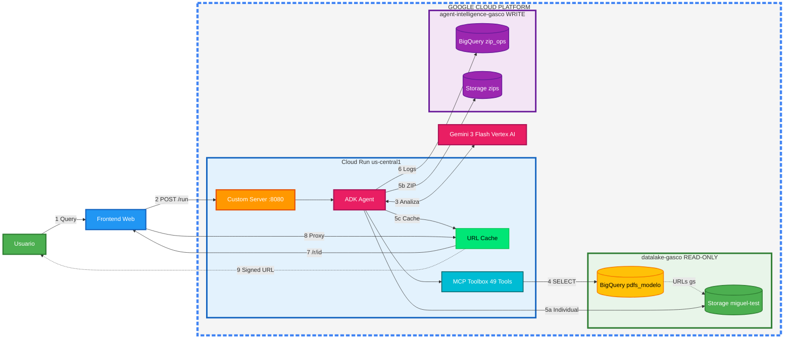

# Arquitectura del Sistema: Invoice Chatbot Backend

**Proyecto**: Invoice Chatbot - Arquitectura Dual-Project GCP
**Fecha**: Febrero 2026
**Version**: 1.1.0

---

## Vista General de la Arquitectura

---

## Explicacion del Flujo (Paso a Paso)

### Flujo Principal

#### **Paso 1: Query (Consulta del Usuario)**
- El usuario escribe una consulta en lenguaje natural
- Ejemplo: _"Dame las facturas del RUT 12345678-9"_
- El frontend captura esta consulta

#### **Paso 2: POST /run (Envio de Request)**
- El frontend envia la consulta al backend
- Metodo: `POST /run`
- Servidor: Custom Server (FastAPI) en Cloud Run puerto 8080

#### **Paso 3: Analiza (Procesamiento con IA)**
- El ADK Agent envia la consulta a **Gemini 3 Flash** (Vertex AI)
- Gemini **analiza la intencion** del usuario
- Decide que herramientas usar para responder

#### **Paso 4: SELECT (Consulta a Base de Datos)**
- El **MCP Toolbox** ejecuta una consulta SQL en BigQuery
- Base de datos: `pdfs_modelo` en proyecto `datalake-gasco`
- Retorna informacion de las facturas encontradas (numero, fecha, URLs de PDFs)

#### **Paso 5a: Individual (Pocas Facturas)**
- Si se encuentran **2 o menos facturas** (configurable en `pdf.zip.threshold`)
- El sistema genera **signed URLs** para cada PDF
- Las signed URLs se almacenan en el **URL Cache** con IDs cortos de 8 caracteres
- El agente devuelve redirect URLs: `/r/{url_id}`

#### **Paso 5b: ZIP (Muchas Facturas)**
- Si se encuentran **mas de 2 facturas**
- El sistema descarga los PDFs y los empaqueta en un archivo ZIP
- Sube el ZIP a Cloud Storage `agent-intelligence-zips`
- Genera signed URL del ZIP y la almacena en el **URL Cache**

#### **Paso 5c: URL Cache**
- Todas las signed URLs se almacenan en cache con IDs de 8 caracteres
- Esto evita que el LLM corrompa las firmas hex de 512 caracteres
- TTL: 7 dias

#### **Paso 6: Logs (Registro de Operaciones)**
- El sistema guarda registro en BigQuery:
  - `zip_operations.zip_packages` - ZIPs generados
  - `zip_operations.extraction_logs` - Historial de consultas
  - `chat_analytics.conversation_logs` - Conversaciones con tokens

#### **Paso 7-8: Redirect URLs (Descarga Segura)**
- El agente retorna URLs cortas al frontend: `https://backend.../r/abc12345`
- Los PDFs se agrupan por numero de factura (`invoices_grouped`)
- El frontend muestra botones por factura (Tributaria, Cedible, etc.)
- Al hacer clic, el frontend llama a su proxy `/api/redirect/{id}`
- El proxy autenticado resuelve la signed URL real desde el cache

#### **Paso 9: Download (Descarga del Usuario)**
- El usuario recibe el PDF/ZIP directamente
- Las signed URLs garantizan acceso seguro y temporal (24 horas)

---

## Glosario de Componentes

### **Usuario**
Persona que utiliza el chatbot para buscar y descargar facturas.

### **Frontend Web**
Interfaz web Next.js donde el usuario interactua con el chatbot.

### **Cloud Run us-central1**
Servicio de Google Cloud que hospeda el backend del chatbot.
- **Ubicacion**: us-central1 (Iowa, USA)
- **Tipo**: Contenedor Docker serverless
- **Escalamiento**: Automatico segun demanda

### **Custom Server :8080**
Servidor FastAPI (`custom_server.py`) que extiende ADK con endpoint de redirect.
- **Puerto**: 8080
- **Endpoint principal**: `/run`
- **Endpoint redirect**: `/r/{url_id}`
- **Health check**: `/list-apps`, `/health/cache`

### **ADK Agent**
"Agent Development Kit" de Google - El cerebro del chatbot.
- **Funcion**: Orquesta todas las operaciones
- **Herramientas**: `generate_individual_download_links`, `create_zip_package`, 49 MCP tools

### **URL Cache**
Cache en memoria (`url_cache.py`) para signed URLs.
- **Funcion**: Almacena signed URLs con IDs cortos de 8 caracteres
- **TTL**: 7 dias
- **Thread-safe**: Si, con locks

### **Gemini 3 Flash Vertex AI**
Modelo de inteligencia artificial de Google.
- **Funcion**: Procesa lenguaje natural
- **Version**: gemini-3-flash-preview
- **Configuracion**: Temperatura 0.3

### **MCP Toolbox 49 Tools**
"Model Context Protocol" - Conjunto de 49 herramientas especializadas.
- **Funcion**: Consultas especificas a BigQuery
- **Puerto**: 5000 (localhost, interno)

### **datalake-gasco READ-ONLY**
Proyecto GCP con datos de produccion (solo lectura).
- **Tabla principal**: `sap_analitico_facturas_pdf_qa.pdfs_modelo`
- **Bucket**: `miguel-test` (PDFs originales)

### **agent-intelligence-gasco WRITE**
Proyecto GCP para operaciones del chatbot (lectura/escritura).
- **Bucket**: `agent-intelligence-zips` (ZIPs generados, TTL 7 dias)
- **BigQuery**: zip_operations, chat_analytics

---

## Decisiones Clave del Sistema

### Individual vs ZIP

**Individual (threshold configurable, default 2 facturas):**
- Descarga inmediata por PDF
- Cada PDF tiene su redirect URL
- Agrupados por numero de factura en la respuesta

**ZIP (> threshold facturas):**
- Una sola descarga
- ZIP con nombre descriptivo
- Preview de las primeras facturas + boton ZIP

### Redirect URLs vs Signed URLs Directas

**Problema:** El LLM corrompe las firmas hex de 512 caracteres de las signed URLs.

**Solucion:** URL Cache con IDs cortos:
- Signed URL (512 chars de firma) → Cache → `/r/abc12345` (8 chars)
- Frontend resuelve via proxy autenticado
- Usuario recibe la signed URL original intacta

### Dos proyectos GCP

**Seguridad y Governance:**
- `datalake-gasco`: Datos inmutables de produccion (solo lectura)
- `agent-intelligence-gasco`: Operaciones del chatbot (lectura/escritura)
- **Beneficio**: El chatbot NO puede modificar datos de produccion

---

## Ejemplo Concreto

**Caso de Uso: "Dame las facturas del RUT 12345678-9 de enero 2025"**

1. **Usuario** escribe en el chat
2. **Frontend** envia `POST /run` al backend
3. **ADK Agent** consulta **Gemini 3 Flash**: interpreta "buscar por RUT y fecha"
4. **MCP Tools** ejecuta SQL en **BigQuery**: `SELECT * WHERE Rut='...' AND Fecha='2025-01'`
5. **Resultado**: 8 facturas encontradas
6. **Decision**: 8 > 2 (threshold) → Generar ZIP
7. Sistema descarga PDFs → Crea ZIP → Sube a **Storage zips**
8. Genera signed URL del ZIP → Almacena en **URL Cache** → Devuelve `/r/zip12345`
9. Tambien genera preview de 3 facturas con redirect URLs agrupadas por `invoice_number`
10. **Frontend** muestra ToolDownloadSection: boton ZIP + preview por factura
11. **Usuario** descarga el ZIP o PDFs individuales via proxy autenticado
