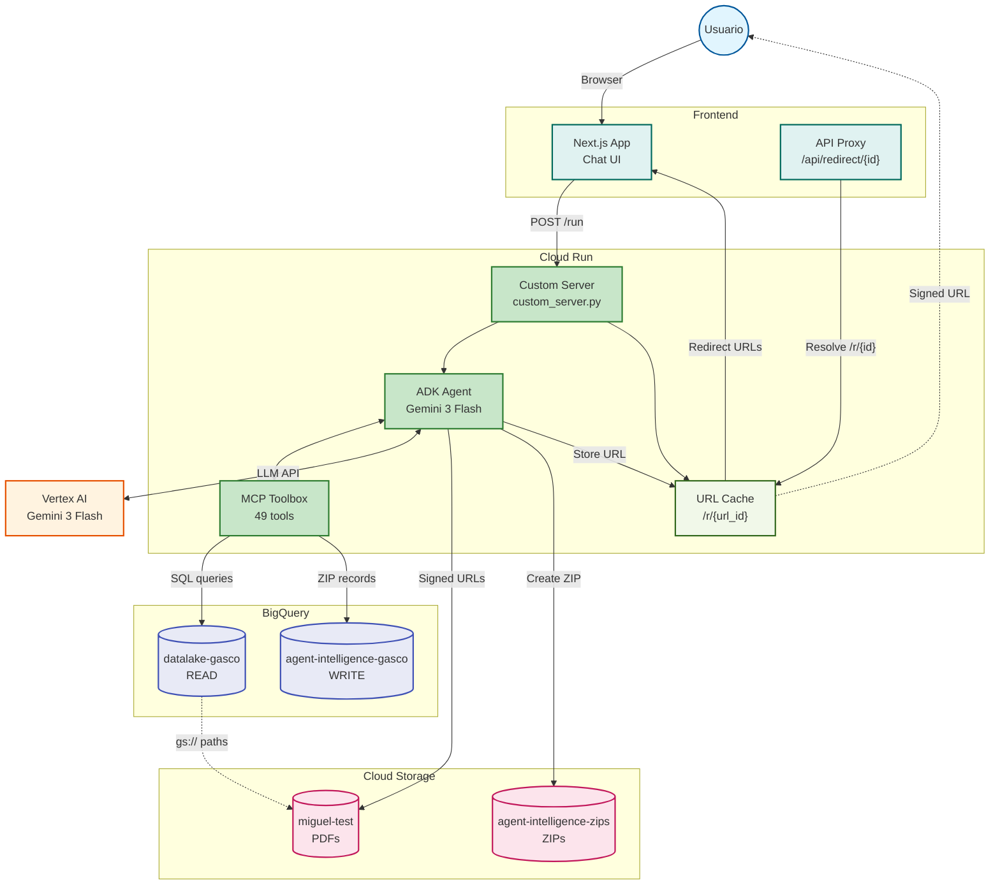

# Invoice Chatbot Backend - Arquitectura GCP



---

## Leyenda

| Servicio | Proyecto/Bucket | Proposito |
|----------|-----------------|-----------|
| **Frontend** | Next.js App | Chat UI + proxy de autenticacion |
| **Custom Server** | `custom_server.py` | FastAPI que extiende ADK con redirect |
| **ADK Agent** | `us-central1` | Agente conversacional con Gemini 3 Flash |
| **MCP Toolbox** | interno (port 5000) | 49 herramientas BigQuery |
| **URL Cache** | in-memory | Signed URLs con IDs cortos (8 chars) |
| **Vertex AI** | Gemini 3 Flash | Procesamiento lenguaje natural |
| **BigQuery READ** | `datalake-gasco` | Consulta facturas (produccion) |
| **BigQuery WRITE** | `agent-intelligence-gasco` | Operaciones ZIPs, logs, analytics |
| **GCS PDFs** | `miguel-test` | PDFs originales de facturas |
| **GCS ZIPs** | `agent-intelligence-zips` | Paquetes ZIP generados (TTL 7 dias) |

## Flujo de Descarga (Redirect URLs)

```
1. ADK genera signed URL para PDF
2. Signed URL se almacena en URL Cache → ID corto (8 chars)
3. Agente responde con redirect URL: /r/abc12345
4. Frontend muestra boton "Cedible" / "Tributaria"
5. Usuario hace clic → Frontend proxy /api/redirect/abc12345
6. Proxy llama backend /r/abc12345 con autenticacion
7. Backend resuelve signed URL desde cache
8. Usuario recibe el PDF
```
