# Invoice Chatbot Backend - Arquitectura GCP

```mermaid
flowchart TB
    %% === USUARIO ===
    User(("👤 Usuario"))
    
    %% === FRONTEND ===
    subgraph Frontend["🖥️ Frontend"]
        WebApp["React App<br/>Chat UI"]
    end
    
    %% === CLOUD RUN ===
    subgraph CloudRun["☁️ Cloud Run"]
        ADK["ADK Agent<br/>invoice-backend"]
        MCP["MCP Toolbox<br/>52 tools"]
        ADK <--> MCP
    end
    
    %% === VERTEX AI ===
    VertexAI["🤖 Vertex AI<br/>Gemini 2.5 Flash"]
    
    %% === BIGQUERY ===
    subgraph BigQuery["📊 BigQuery"]
        BQ_READ[("datalake-gasco<br/>READ")]
        BQ_WRITE[("agent-intelligence-gasco<br/>WRITE")]
    end
    
    %% === CLOUD STORAGE ===
    subgraph GCS["📁 Cloud Storage"]
        GCS_PDF[("miguel-test<br/>PDFs")]
        GCS_ZIP[("agent-intelligence-zips<br/>ZIPs")]
    end
    
    %% === CONEXIONES ===
    User -->|"Browser"| WebApp
    WebApp -->|"REST API"| CloudRun
    ADK <-->|"LLM API"| VertexAI
    MCP -->|"SQL queries"| BQ_READ
    MCP -->|"ZIP records"| BQ_WRITE
    BQ_READ -.->|"gs:// paths"| GCS_PDF
    ADK -->|"Create ZIP"| GCS_ZIP
    GCS_PDF -->|"Signed URLs"| WebApp
    GCS_ZIP -->|"Signed URLs"| WebApp
    
    %% === ESTILOS ===
    classDef userStyle fill:#e1f5fe,stroke:#01579b,stroke-width:2px
    classDef cloudrunStyle fill:#c8e6c9,stroke:#2e7d32,stroke-width:2px
    classDef vertexStyle fill:#fff3e0,stroke:#e65100,stroke-width:2px
    classDef bqStyle fill:#e8eaf6,stroke:#3f51b5,stroke-width:2px
    classDef gcsStyle fill:#fce4ec,stroke:#c2185b,stroke-width:2px
    
    classDef frontendStyle fill:#e0f2f1,stroke:#00695c,stroke-width:2px
    
    class User userStyle
    class WebApp frontendStyle
    class ADK,MCP cloudrunStyle
    class VertexAI vertexStyle
    class BQ_READ,BQ_WRITE bqStyle
    class GCS_PDF,GCS_ZIP gcsStyle
```

---

## Leyenda

| Servicio | Proyecto/Bucket | Propósito |
|----------|-----------------|-----------|
| **Frontend** | React App | Chat UI para usuarios |
| **Cloud Run** | `us-central1` | API REST + ADK Agent |
| **MCP Toolbox** | interno | 52 herramientas BigQuery |
| **Vertex AI** | Gemini 2.5 Flash | Procesamiento lenguaje natural |
| **BigQuery READ** | `datalake-gasco` | Consulta facturas (producción) |
| **BigQuery WRITE** | `agent-intelligence-gasco` | Operaciones ZIPs, logs |
| **GCS PDFs** | `miguel-test` | PDFs originales de facturas |
| **GCS ZIPs** | `agent-intelligence-zips` | Paquetes ZIP generados |
