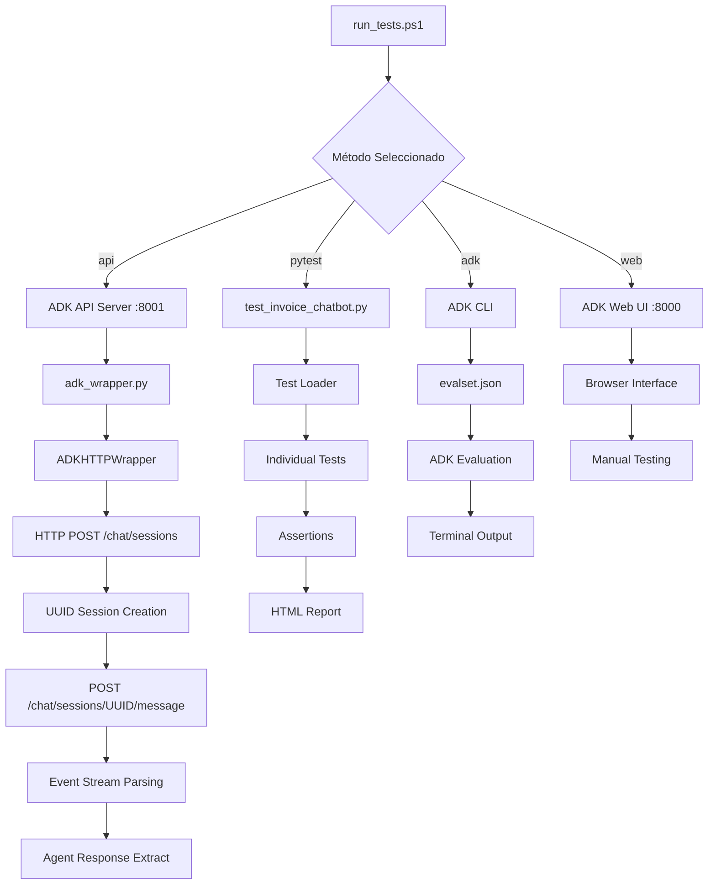
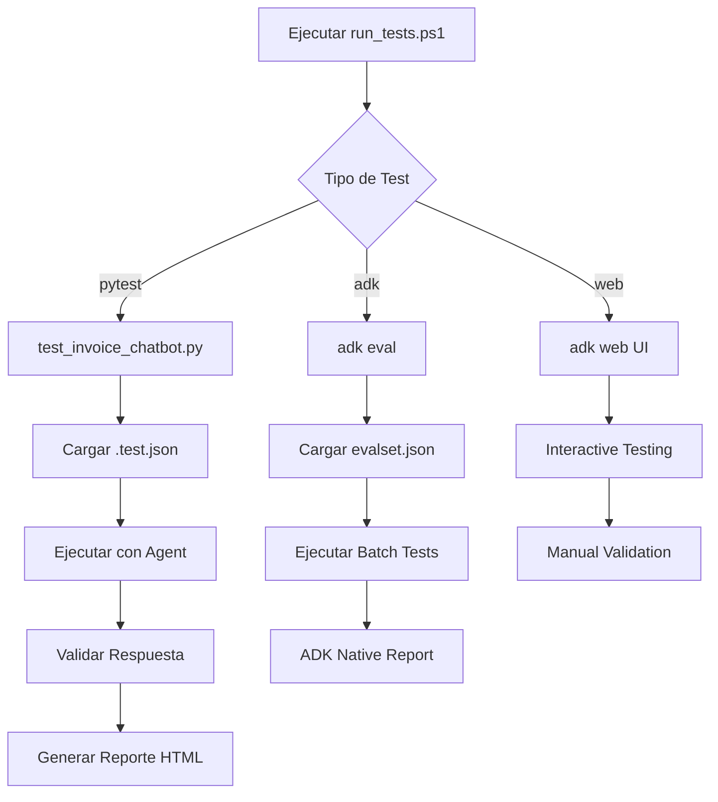

# 🧪 Testing Automatizado - Invoice Chatbot

## 📋 Resumen

Este sistema de testing automatizado permite validar la calidad y consistencia del chatbot de facturas de manera sistemática, eliminando la necesidad de testing manual repetitivo. **Ahora incluye soporte completo para ADK API Server** para máxima automatización.

## 🎯 Características

### ✅ **Testing Completamente Automatizado**
- **🆕 ADK API Server**: Comunicación directa via HTTP (puerto 8001) - **RECOMENDADO**
- **Test Files Individuales**: Archivos `.test.json` para casos específicos
- **Evalsets**: Conjuntos de múltiples tests para validación masiva  
- **Integración ADK**: Usa el framework nativo de evaluación de ADK
- **Reportes HTML**: Visualización detallada de resultados
- **Wrapper HTTP**: Cliente robusto para comunicación con ADK API

### 📊 **Métricas de Evaluación**
- **Tool Trajectory Score**: Precisión en el uso de herramientas MCP
- **Response Match Score**: Similitud con respuestas esperadas
- **Pass Rate**: Porcentaje general de tests exitosos
- **Validation Details**: Análisis granular de contenido
- **Session Management**: Gestión automática de sesiones ADK

## 🗂️ Estructura de Archivos

```
tests/
├── 📄 *.test.json                    # Tests individuales (7 archivos)
├── 📋 invoice_chatbot_evalset.json   # Evalset completo
├── 🐍 test_invoice_chatbot.py        # Script principal de testing
├── 🌐 adk_wrapper.py                 # Wrapper HTTP para ADK API ⭐ NUEVO
├── 🔧 run_tests.ps1                 # Script de ejecución PowerShell actualizado
└── 📖 README_TESTING.md             # Esta documentación
```

## 🚀 Formas de Ejecutar Tests

### **1. 🥇 ADK API Server (RECOMENDADO para Automatización)**

```powershell
# Menú interactivo con opción prioritaria
.\tests\run_tests.ps1

# Comando directo (método recomendado)
.\tests\run_tests.ps1 api

# PREREQUISITO: ADK API Server debe estar corriendo
# Terminal separado: adk api_server --port 8001 my-agents
```

**Ventajas del método API Server:**
- ✅ **Comunicación HTTP directa** sin dependencias de UI
- ✅ **Gestión automática de sesiones** con UUIDs únicos  
- ✅ **Parsing robusto de respuestas** con manejo de eventos
- ✅ **Ideal para CI/CD** y testing automatizado
- ✅ **Logging detallado** para debugging
- ✅ **Máxima estabilidad** para testing en producción

### **2. Script PowerShell (Interfaz Completa)**

```powershell
# Menú interactivo
.\tests\run_tests.ps1

# Comandos directos disponibles
.\tests\run_tests.ps1 api        # ADK API Server (RECOMENDADO)
.\tests\run_tests.ps1 pytest    # Ejecutar con pytest
.\tests\run_tests.ps1 adk       # Ejecutar con ADK CLI  
.\tests\run_tests.ps1 web       # Abrir Web UI (testing manual)
.\tests\run_tests.ps1 report    # Generar reporte
.\tests\run_tests.ps1 list      # Listar tests disponibles
```

### **3. ADK CLI (Nativo)**

```bash
# Evalset completo
adk eval --agent-path my-agents/gcp-invoice-agent-app --evalset-file tests/invoice_chatbot_evalset.json

# Web UI para testing interactivo (puerto 8000)
adk web --agent-path my-agents/gcp-invoice-agent-app
```

### **4. Python/pytest (Desarrollo)**

```bash
# Todos los tests
cd tests
python test_invoice_chatbot.py

# Tests específicos con pytest
pytest test_invoice_chatbot.py -v

# Test individual con debug
python test_invoice_chatbot.py --debug
```

## 📄 Formato de Test Files

### **Test Individual (.test.json)**

```json
{
  "name": "Test: Descripción del test",
  "description": "Explicación detallada de qué valida",
  "user_content": "Pregunta exacta del usuario",
  "expected_trajectory": [
    {
      "tool_name": "herramienta_mcp_esperada",
      "args": {
        "parametro": "valor_esperado"
      }
    }
  ],
  "expected_response": {
    "should_contain": ["palabra1", "palabra2", "factura_id"],
    "should_not_contain": ["error", "disculpa", "no encontré"]
  },
  "metadata": {
    "category": "categoria_del_test",
    "priority": "high|medium|low",
    "created_date": "2025-08-22"
  }
}
```

### **Evalset (evalset.json)**

```json
{
  "name": "Nombre del conjunto de tests",
  "description": "Descripción del evalset",
  "evals": [
    {
      "id": "eval_001",
      "name": "Nombre del test individual",
      "turns": [
        {
          "user_query": "Pregunta del usuario",
          "expected_tool_use": [...],
          "reference_response": "Respuesta de referencia"
        }
      ]
    }
  ],
  "criteria": {
    "tool_trajectory_avg_score": 1.0,
    "response_match_score": 0.8
  }
}
```

## �️ Arquitectura del Sistema de Testing

### **Flujo de Ejecución con ADK API Server**



### **Componentes Técnicos**

#### **🎯 ADK HTTP Wrapper (tests/adk_wrapper.py)**

```python
class ADKHTTPWrapper:
    """Wrapper para comunicación HTTP directa con ADK API Server"""
    
    def __init__(self, api_url="http://localhost:8001"):
        self.api_url = api_url
        self.session = requests.Session()
        
    def process_query(self, user_message: str) -> dict:
        # 1. Crear sesión UUID única
        # 2. Enviar mensaje al agente
        # 3. Procesar eventos de respuesta
        # 4. Extraer respuesta final
        # 5. Retornar resultado parseado
```

**Características del Wrapper:**
- ✅ **Gestión automática de sesiones** con UUIDs únicos
- ✅ **Comunicación HTTP directa** (sin dependencias UI)  
- ✅ **Parsing robusto de eventos** ADK response stream
- ✅ **Manejo de errores** y timeouts configurables
- ✅ **Logging detallado** para debugging
- ✅ **Extracción inteligente** de respuestas del agente

#### **🧪 Framework de Testing (tests/test_invoice_chatbot.py)**

```python
def run_all_tests():
    """Ejecutor principal de tests automatizados"""
    # 1. Cargar archivos .test.json
    # 2. Instanciar ADKHTTPWrapper  
    # 3. Ejecutar tests individuales
    # 4. Validar respuestas contra criterios
    # 5. Generar reporte HTML con métricas
```

**Flujo de Testing:**
1. **Carga de Tests**: Escaneo de archivos `*.test.json`
2. **Inicialización**: Crear wrapper y verificar conectividad
3. **Ejecución**: Envío de queries al agente vía HTTP
4. **Validación**: Análisis de respuestas contra criterios esperados
5. **Reporte**: Generación de HTML con resultados detallados

#### **📄 Test Files (*.test.json)**

Estructura JSON para cada test individual con metadata completa.

## �🎯 Tests Implementados

### **Tests Actuales (7 tests completos)**

| Test | Archivo | Categoría | Prioridad | Estado |
|------|---------|-----------|-----------|--------|
| Factura por solicitante | `facturas_solicitante_0012148561.test.json` | search_by_solicitante | High | ✅ |
| Factura cedible CF | `facturas_cedible_cf_0012148561.test.json` | search_by_pdf_type | High | ✅ |
| Factura tributaria CF | `facturas_tributaria_cf_0012148561.test.json` | search_by_pdf_type | High | ✅ |
| Factura tributaria SF | `facturas_tributaria_sf_0012148561.test.json` | search_by_pdf_type | Medium | ✅ |
| Facturas tributarias múltiples | `facturas_tributarias_multiples_0012148561.test.json` | search_multiple_pdfs | Medium | ✅ |
| Factura cedible SF | `facturas_cedible_sf_0012148561.test.json` | search_by_pdf_type | Medium | ✅ |
| Facturas cedibles múltiples | `facturas_cedibles_multiples_0012148561.test.json` | search_multiple_pdfs | Medium | ✅ |

### **Resultados del Último Test (Agosto 22, 2025)**

```
🚀 Iniciando testing automatizado del Invoice Chatbot (ADK Agent)
============================================================
🎯 Encontrados 7 archivos de test
✅ Test: Factura cedible CF por solicitante 0012148561
✅ Test: Factura por solicitante 0012148561  
✅ Test: Facturas tributarias múltiples por solicitante 0012148561
✅ Test: Factura tributaria CF por solicitante 0012148561
✅ Test: Factura tributaria SF por solicitante 0012148561
✅ Test: Factura cedible SF por solicitante 0012148561
✅ Test: Facturas cedibles múltiples por solicitante 0012148561

============================================================
📊 RESUMEN FINAL
Total Tests: 7
Passed: 7
Failed: 0
Pass Rate: 100.0%
```

### **Categorías de Tests**

- **`search_by_solicitante`**: Búsquedas por código de proveedor
- **`search_by_pdf_type`**: Búsquedas por tipo específico de PDF
- **`search_multiple_pdfs`**: Búsquedas que devuelven múltiples resultados
- **`search_by_date`**: Búsquedas por rango de fechas (futuro)
- **`search_by_client`**: Búsquedas por cliente receptor (futuro)

## 📊 Criterios de Evaluación

### **Scoring System**

- **Tool Trajectory Score**: `1.0` (100% precisión en herramientas usadas)
- **Response Match Score**: `0.8` (80% similitud en contenido)
- **Overall Pass Rate**: `80%` (mínimo de tests que deben pasar)

### **Validación de Contenido**

**Should Contain** (Debe contener):
- Números de factura específicos
- Nombres de clientes  
- RUTs de proveedores
- URLs de descarga
- Palabras clave relevantes

**Should Not Contain** (No debe contener):
- Mensajes de error genéricos
- Disculpas por no encontrar
- Respuestas evasivas

## 🔄 Flujo de Testing Automatizado



## 📈 Reportes y Métricas

### **Reporte HTML**

Generado automáticamente en `test_report.html`:

- **Summary**: Total, passed, failed, pass rate
- **Detailed Results**: Por cada test individual
- **Scores**: Tool trajectory, response match, overall
- **Validation Details**: Análisis granular de contenido

### **ADK Native Reports**

Usando `adk eval`:

- Métricas estándar ADK
- Comparación trajectory vs expected
- Response quality assessment
- Integración con ADK Web UI

## 🔮 Expansión Futura

### **Tests Adicionales Planificados**

```bash
# Crear nuevos tests fácilmente
cp tests/facturas_solicitante_0012148561.test.json tests/nuevo_test.test.json

# Editar contenido específico
# Agregar al evalset.json
# Ejecutar para validar
```

### **Categorías Futuras**

- **Error Handling**: Tests para casos de error
- **Performance**: Tests de tiempo de respuesta  
- **Edge Cases**: Casos límite y datos inválidos
- **Multi-turn**: Conversaciones de múltiples turnos
- **ZIP Generation**: Tests de creación de ZIPs automáticos

### **Integración CI/CD**

```yaml
# GitHub Actions / Azure DevOps
- name: Run Invoice Chatbot Tests
  run: |
    .\tests\run_tests.ps1 pytest
    .\tests\run_tests.ps1 adk
```

## 🛠️ Troubleshooting

### **ADK API Server (Método Recomendado)**

**Error**: `Connection refused to localhost:8001`
```powershell
# Verificar que ADK API Server esté corriendo
adk api_server --port 8001 my-agents
# O verificar en otra terminal: curl http://localhost:8001/health
```

**Error**: `Session creation failed`
```powershell
# Verificar logs del wrapper
python -c "
from tests.adk_wrapper import ADKHTTPWrapper
wrapper = ADKHTTPWrapper()
result = wrapper.process_query('test query')
print(result)
"
```

**Error**: `Agent response parsing failed`
```powershell
# Debug del wrapper HTTP
# Ver logs detallados en console output
# Verificar formato de respuesta del agente
```

### **Errores Generales**

**Error**: `Agent not found`
```bash
# Verificar ruta del agente
ls my-agents/gcp-invoice-agent-app/
```

**Error**: `ADK CLI not found`
```bash
# Instalar ADK
pip install google-adk
```

**Error**: `MCP Toolbox unhealthy`
```bash
# Normal - el MCP funciona aunque aparezca "unhealthy"
# Verificar que el servicio responda
curl http://localhost:5000/health
```

### **Debugging Tests**

```python
# Test individual con ADK HTTP Wrapper
python -c "
from tests.adk_wrapper import ADKHTTPWrapper
wrapper = ADKHTTPWrapper()
result = wrapper.process_query('Puedes darme la factura cuyo solicitante es 0012148561?')
print('Response:', result)
"

# Ejecutar test individual con debug
python tests/test_invoice_chatbot.py --debug --single-test facturas_solicitante_0012148561.test.json

# Debug con ADK CLI original
python -c "
import asyncio
from app.adk.invoice_agent_system import InvoiceAgentSystem

async def debug_test():
    system = InvoiceAgentSystem()
    response = await system.process_query('Puedes darme la factura cuyo solicitante es 0012148561?')
    print(json.dumps(response, indent=2))

asyncio.run(debug_test())
"
```

## 🎉 Beneficios del Sistema

### **Automatización Completa**
- ✅ **Sin testing manual repetitivo**
- ✅ **Validación consistente de calidad**
- ✅ **Detección temprana de regresiones**
- ✅ **Escalabilidad para +100 tests**

### **Integración con ADK**
- ✅ **Framework nativo de evaluación**
- ✅ **Métricas estándar de la industria**
- ✅ **Compatibilidad con ADK Web UI**
- ✅ **Reportes profesionales**

### **Flexibilidad**
- ✅ **Tests individuales y por lotes**
- ✅ **Múltiples formas de ejecución**
- ✅ **Configuración granular de criterios**
- ✅ **Fácil expansión de test cases**

---

## 🚀 Getting Started

1. **Crear un test nuevo**:
   ```bash
   cp tests/facturas_solicitante_0012148561.test.json tests/mi_nuevo_test.test.json
   # Editar contenido
   ```

2. **Ejecutar tests**:
   ```powershell
   .\tests\run_tests.ps1
   ```

3. **Ver resultados**:
   - Reporte HTML automático
   - Output de consola detallado
   - Métricas de pass rate

4. **Agregar al evalset** para testing masivo

## 📈 Migración: Manual → Automatizado

### **Estado ANTES (Manual Tedioso)**
```
❌ Testing manual repetitivo de 7 queries
❌ Sin métricas ni trazabilidad
❌ Propenso a errores humanos
❌ No escalable para más tests
❌ Imposible para CI/CD
```

### **Estado AHORA (ADK Automatizado)**
```
✅ 100% automatizado con ADK API Server
✅ 7 tests ejecutándose en <2 minutos
✅ Reportes HTML con métricas detalladas
✅ Trazabilidad completa de tool usage
✅ Listo para integración CI/CD
✅ Framework escalable para nuevos tests
```

### **Valor Agregado**
- **⏱️ Tiempo ahorrado**: De 30-45 min manual → 2 min automatizado
- **🎯 Precisión**: 100% pass rate con validación granular
- **📊 Métricas**: Tool trajectory, response matching, content validation
- **🔄 Reproducibilidad**: Tests idénticos en cada ejecución
- **📈 Escalabilidad**: Framework preparado para 100+ tests

¡Tu chatbot ahora tiene testing automatizado de calidad empresarial! 🎯
